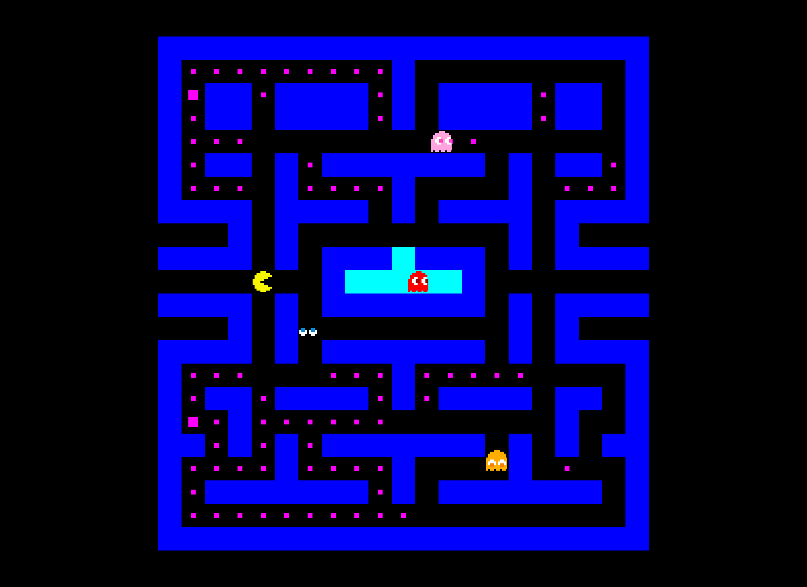

# Munch

Pacman clone, written in Rust with the [ggez](https://github.com/ggez/ggez) game engine. Control Munch with the arrow keys.



## Building

Make sure you have [Rust and Cargo](https://www.rust-lang.org/tools/install) installed.

Then run:

```sh
cargo run
```
